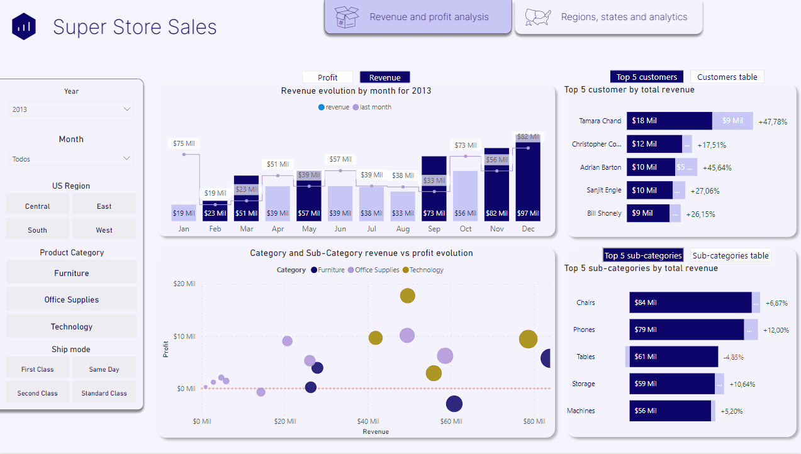
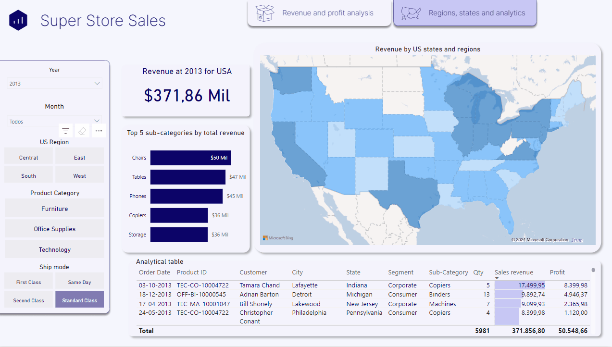

# Super store sales Power BI dashboard

### This business intelligence project in Power BI was created from a database collected on the Kaggle website. The database used is the Super Store and can be downloaded for free via this [link](https://www.kaggle.com/datasets/itssuru/super-store).

## Objective

#### The objective of this dashboard is to highlight some of Power BI's advanced features as well as highlight the importance of using intelligent time and demographic analysis. In this panel, the list of filters from different categories provides a more objective analysis for the user.

## About data transformation

#### The data was obtained through an Excel spreadsheet available in the introduction link on the Kaggle website.

## Revenue and profit analysis tab

#### The Revenue and profit analysis tab provides analyzes relating to product revenue and profit within the selected year and month period. Here it is possible to see time intelligence measures such as comparisons of month-to-month evolution and the possibility of evaluating the performance of each product sub-category by evaluating its total revenue and whether it made a profit or not. Also noteworthy is the possibility of seeing the "top 5" in total revenue and profit for the customer and sub-category categories with the possibility of seeing the table for all those selected.
&nbsp;

## Regions, states and analytics tab

#### The Regions, States and analytics tab has as its main graphic element a chloroplectic map highlighting the US states according to total revenue within the selected year and month period. Below the graph there is a table with detailed revenue data for possible extraction by the user who wishes to carry out a deeper analysis of the entries.

## Next steps

### This is the fourth panel in this data repository and this work brings me a lot of satisfaction as I see that today I can work with most of the possibilities that Power BI offers to improve data analysis and bring value to the user's decision making.

## Author
- Tiago Bratz Heck
##### Access my [LinkedIn](https://www.linkedin.com/in/tiago-bratz-heck-0b9b5696/) profile.